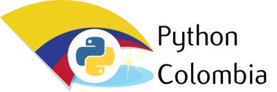

# Python Colombia Charla



Este repositorio contiene los materiales y ejemplos para una charla sobre Python presentada en la comunidad de Python Colombia. Aquí podrás encontrar ejemplos de código, herramientas y conceptos clave para trabajar con Python.

## Tabla de Contenidos
- [Descripción](#descripción)
- [Instalación](#instalación)
- [Uso](#uso)
- [Estructura del Proyecto](#estructura-del-proyecto)
- [Contribución](#contribución)
- [Licencia](#licencia)

## Descripción

Este repositorio está diseñado como un recurso educativo para aprender más sobre Python, cubriendo diferentes aspectos del lenguaje y sus aplicaciones. Durante la charla, se discuten varios temas, desde los fundamentos básicos de FastAPI hasta casos de uso más avanzados con Pytest.

### Contenidos:

- **Demostraciones de cómo utilizar FastAPI, Pytest y SQLModel**.
- **Buenas prácticas en Python**.
- **Conceptos de pruebas y simulación**.

El objetivo es proporcionar un conjunto de recursos que los asistentes puedan usar como referencia para comenzar a trabajar con Python o mejorar sus habilidades.

## Instalación

Para ejecutar el proyecto de este repositorio, sigue estos pasos:

### Requisitos previos

- Python 3.7 o superior.
- `pip` para gestionar las dependencias.

### Paso 1: Clonar el repositorio

```bash
git clone https://github.com/EspejelKevin/python-colombia-charla.git
```

### Paso 2: Navegar al directorio del proyecto

```bash
cd python-colombia-charla
```

### Paso 3: Instalar las dependencias

El proyecto requiere dependencias, las cuáles están listadas en un archivo `requirements.txt`. 
Instálalas usando:

```bash
pip install -r requirements.txt
```

## Uso

Para ejecutar el proyecto pueden usar la línea de comandos y correr el siguiente comando. Por ejemplo:

```bash
python app/main.py
```

Al ejecutar el script, podrás ver la salida correspondiente del server de *Uvicorn*.

## Estructura del Proyecto

Este es un resumen de los archivos y carpetas principales dentro del repositorio:

- `app/`: Contiene el código utilizado durante la charla.
    - `controllers/`: Lógica del GameController.
    - `models/`: Definición de la tabla Game.
    - `repositories`: Lógica para interactuar con la base de datos SQLite.
    - `routes`: Implementación de endpoints para operaciones CRUD.
    - `schemas`: Creación de schemas como: GameSchema, UpdateGame, etc. Para mapeo de datos.
    - `services/`: Contrato de interfaz entre controlador y repository.
    - `container.py`: Archivo para la gestión de inyección de dependencias.
    - `db.py`: Archivo para crear la conexión a base de datos.
    - `main.py`: Entrypoint de la aplicación.
- `tests/`: Contiene los test unitarios creados con Pytest y Pytest-Mock.
    - `controllers/`: Lógica de los test unitarios para el GameController.
    - `repositories/`: Lógica de los test unitarios para el GameRepository.
    - `services/`: Lógica de los test unitarios para el GameService.
    - `conftest.py`: Archivo de configuración para los test unitarios.
    - `pytest.ini`: Archivo de configuración para pytest.
- `README.md`: Este archivo con información sobre el repositorio.
- `requirements.txt`: Lista de dependencias para el proyecto.
- `Dockerfile`: Dockerfile para levantar el servicio con Docker (pasos no incluidos).


## Contribución

Si deseas contribuir a este repositorio, siéntete libre de hacer un fork y enviar un Pull Request. Por favor, sigue estos pasos:

1. Haz un fork del repositorio.
2. Crea una nueva rama para tu funcionalidad (`git checkout -b feature/nueva-funcionalidad`).
3. Realiza los cambios necesarios.
4. Haz commit de tus cambios (`git commit -m 'Agrega nueva funcionalidad'`).
5. Empuja tus cambios a tu repositorio remoto (`git push origin feature/nueva-funcionalidad`).
6. Abre un Pull Request en el repositorio original.

## Licencia

Este proyecto está bajo la Licencia MIT. Consulta el archivo [LICENSE](LICENSE) para más detalles.

---
